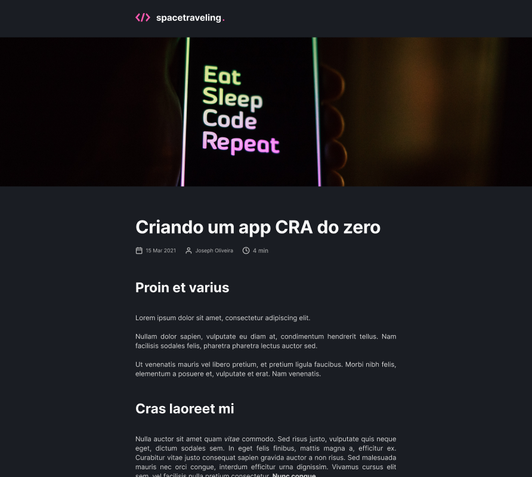

<!-- Logotipo -->
<div align="center">
  
</div>

<!-- Title -->
<h1 align="center"> Rocketseat 🔥 Ignite ReactJS </h1>

<!-- Preview -->
<div align="center">
  
</div>

<!-- Sobre o Projeto -->

## 🧐 Sobre o Projeto

O projeto tem como objetivo o estudo e desenvolvimento de uma aplicação em ReactJS com NextJS para listagem de posts de um blog.

A aplicação foi desenvolvida utilizando o framework NextJS aplicando os conceitos de Static Site Generation (SSG) e utilizando Prismic CMS para adição e gerenciamento do conteúdo dos posts.

O projeto foi desenvolvido como desafio das aulas do módulo 03 do Ignite da Rocketseat.

## 🚀 Tecnologias e Bibliotecas

- [ReactJS](https://reactjs.org/)
- [NextJS](https://nextjs.org/)
- [TypeScript](https://www.typescriptlang.org/)
- [SASS](https://sass-lang.com/)
- [Prismic CMS](https://prismic.io/)
- [Utterances](https://utteranc.es/)

## 💻 Rodando o Projeto

```
# Abra um terminal e copie este repositório com o comando
$ git clone https://github.com/lucasbarque/Space-Traveling.git

# Acesse a pasta da aplicação
$ cd Space-Traveling

# Crie um arquivo .env.local e coloque as variáveis
# de ambiente baseado no arquivo .env.example

# Instale as dependências
$ yarn

# Inicie a aplicação
$ yarn dev

```

© 2022 GitHub, Inc.
Terms
Privacy
Security
Stat
